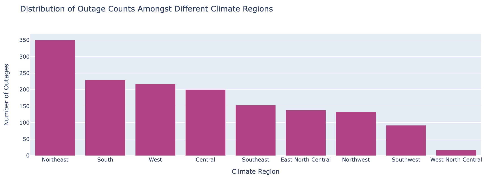
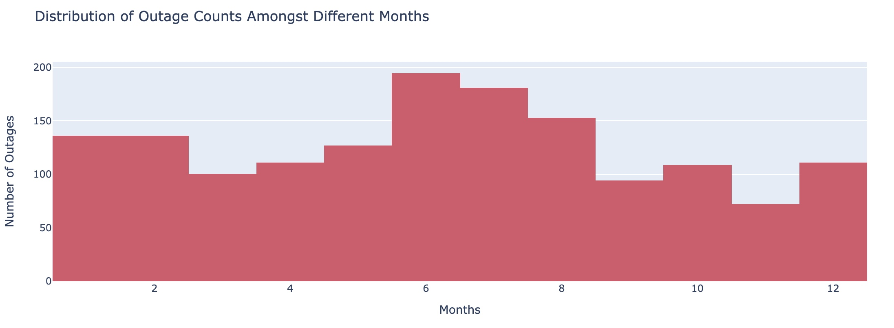
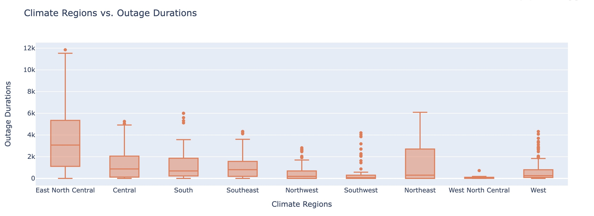
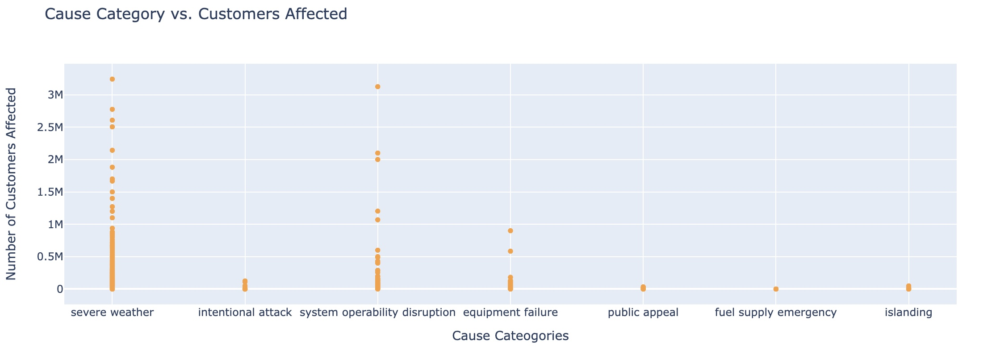
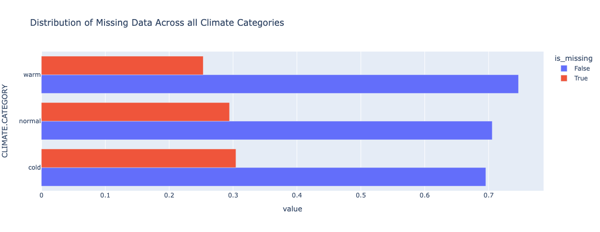
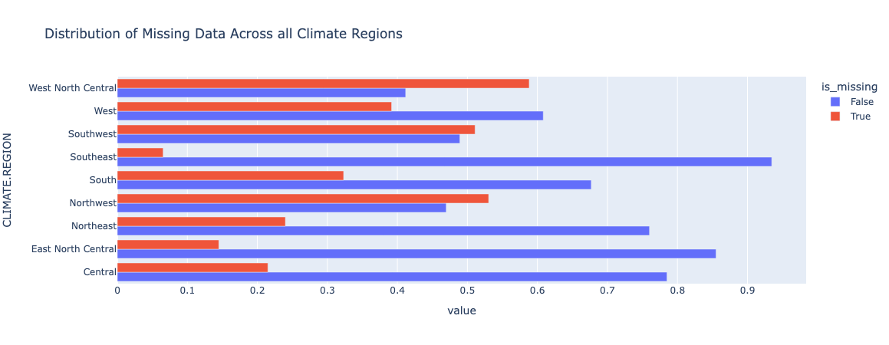
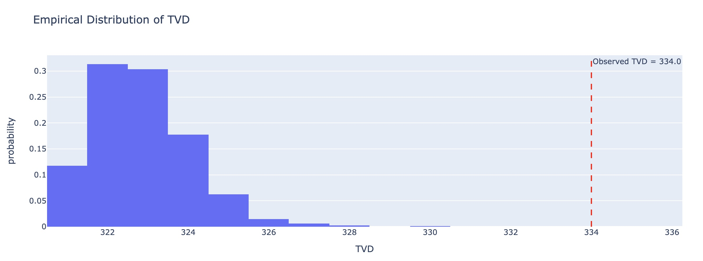

#  Power Outage Analysis 
Fall '24 DSC 80 Project 

**By:** Vivian Lin, Selina Zhang

## Introduction
This project revolves around a dataset that provides rich information about power outages across the states, including time, location, climate conditions, and urbanization levels. We can use this dataset to identify patterns of power outages to infer problems of these outages. The main question is **where are the causes of major outages?** Readers of our website should care because we use electricity to make everything easier for our lives such as lights, various machinaries, and the internet. Thus, analyzing power outages can help us better prepare for where outages are more likely to happen and where do dedicate more resources to the regions where more people are affected. 

The dataset comprises of 1534 rows.

Although there is a total of 57 columns, we are only going to use the ones below:

| **Column Name**       | **Description**                                                                                                                                                                |
|-----------------------|--------------------------------------------------------------------------------------------------------------------------------------------------------------------------------|
| `YEAR`                | Year when the outage event occurred.                                                                                                                                             |
| `MONTH`               | Month when the outage event occurred.                                                                                                                                            |
| `NERC.REGION`         | The North American Electric Reliability Corporation (NERC) regions impacted by the outage event.                                                                               |
| `CLIMATE.REGION`      | U.S. Climate regions as specified by the National Centers for Environmental Information.                                                                                         |
| `CLIMATE.CATEGORY`    | Represents the climate episodes corresponding to the years. The categories are “Warm”, “Cold”, or “Normal”.                                                                    |
| `CAUSE.CATEGORY`      | Categories of events causing the major power outages (e.g., weather-related, equipment failure, human error, etc.).                                                             |
| `OUTAGE.DURATION`     | Duration of the outage event (measured in hours, days, etc.).                                                                                                                  |
| `CUSTOMERS.AFFECTED`  | Number of customers affected by the power outage event.                                                                                                                        |
| `RES.PERCEN`          | Percentage of residential electricity consumption compared to the total electricity consumption in the state (in %).                                                          |
| `ANOMALY.LEVEL`       | Represents the oceanic El Niño/La Niña (ONI) index referring to cold and warm episodes by season. It is estimated as a 3-month running mean of ERSST.v4 SST anomalies in the Niño 3.4 region (5°N to 5°S, 120–170°W). |
| `TOTAL.REALGSP`       | Real Gross State Product (GSP) contributed by all industries (total), measured in 2009 chained U.S. dollars.                                                                  |
| `DEMAND.LOSS.MW`      | Amount of peak demand lost during an outage event (in Megawatts). In many cases, total demand is reported as the description.                                                  |

## Data Cleaning and Exploratory Data Analysis

We cleaned the data set by just extracting the relevent columns of `YEAR`, `MONTH`, `NERC.REGION`, `CLIMATE.REGION`, `CLIMATE.CATEGORY`, `CAUSE.CATEGORY`, `OUTAGE.DURATION` , `CUSTOMERS.AFFECTED`, `RES.PERCEN`, `ANOMALY.LEVEL`, and `DEMAND.LOSS.MW`.

Although we did not initially make any new columns in this step, we made copies of this original dataframe and added necessary columns for those particular steps. 

### First 5 Rows of Dataset

| **YEAR** | **MONTH** | **NERC.REGION** | **CLIMATE.REGION** | **CLIMATE.CATEGORY** | **CAUSE.CATEGORY**  | **OUTAGE.DURATION** | **CUSTOMERS.AFFECTED** | **RES.PERCEN** | **ANOMALY.LEVEL** | **TOTAL.REALGSP** | **DEMAND.LOSS.MW** |
|----------|-----------|-----------------|--------------------|----------------------|---------------------|---------------------|-----------------------|----------------|-------------------|-------------------|---------------------|
| 2011     | 7         | MRO             | East North Central | normal               | severe weather      | 3060                | 70000                 | 35.549073       | -0.3              | 274182            | NaN                 |
| 2014     | 5         | MRO             | East North Central | normal               | intentional attack  | 1                   | NaN                   | 30.032487       | -0.1              | 291955            | NaN                 |
| 2010     | 10        | MRO             | East North Central | cold                 | severe weather      | 3000                | 70000                 | 28.097672       | -1.5              | 267895            | NaN                 |
| 2012     | 6         | MRO             | East North Central | normal               | severe weather      | 2550                | 68200                 | 31.994099       | -0.1              | 277627            | NaN                 |
| 2015     | 7         | MRO             | East North Central | warm                 | severe weather      | 1740                | 250000                | 33.982576       | 1.2               | 292023            | 250                 |

### Univariate Analyses
When performing univariate analyses, we observe for the distribution of single variables.

#### Distribution of Outages in Different Climate Regions

As observed, the greatest number of outages reported in the years 2000 to 2016 are the Northeast and South regions.

#### Distribution of Outages Across Different Months of the Year

As observed, outages are reported in the largest numbers in the months of June, July, and August. These months are in the season of summer, therefore according to the graph, outages are more likely to happen in the summer.

### Bivariate Analyses
When performing bivariate analyses, we observe for the relationship of two variables.

#### Climate Region vs. Outage Duration

To achieve this plot, we calculated the grouped z-score by `CLIMATE.REGION` of all `OUTAGE.DURATION` and made the z-score threshold to be within approximately -0.5 to 0.5 to remove any significant outliers to give us a better representation to give us a more general comparison between all regions. 

In this plot, we observe the relationship between the different climate regions and different quartile measurements (1st quartile, Median, 3rd Quartile) of the outage durations of each regions. The East North Central Region have the highest Q1, median, and Q3 outage duration. 

#### Cause Category vs. Customers Affected

In this plot, we observe the relationship between the `CAUSE.CATEGORY` and `CUSTOMERS.AFFECTED`. The two major causes for more severe outages, meaning that on average, customers affected was the greatest because of these two causes are severe weather and system operation disruptions.

### Interesting Aggregates

In our data frame, we created a new column which is `customers_affected_ranges`, which is categorize `CUSTOMERS.AFFECTED` into different ranges which are `(0, 1M], (1M, 2M], (2M, 3M], (3M, )`. These ranges are based on the actual numbers from `CUSTOMERS.AFFECTED`. In this pivot table, we grouped by the different climate regions and performed an aggregate function of count() to determine how many outages occurred within each customer range for each region. The purpose of this aggregation is to identify the customer range in which each climate region is most likely to fall. By analyzing this historical data, we can gain insights into the patterns of customer impact, especially in extreme cases where outages affect a larger number of customers. This helps in understanding which ranges tend to have more frequent outages and provides a better understanding of the distribution of affected customers across different regions. 

| **CLIMATE.REGION**           | **(0, 1M]** | **(1M, 2M]** | **(2M, 3M]** | **(3M, )** |
|--------------------------|---------|----------|----------|--------|
| **Central**                  | 156     | 1        | 0        | 0      |
| **East North Central**      | 117     | 0        | 1        | 0      |
| **Northeast**              | 265     | 0        | 0        | 1      |
| **Northwest**                | 62      | 0        | 0        | 0      |
| **South**                    | 149     | 4        | 2        | 0      |
| **Southeast**                | 140     | 1        | 1        | 1      |
| **Southwest**                | 45      | 0        | 0        | 0      |
| **West**                     | 125     | 6        | 1        | 0      |
| **West North Central**       | 7       | 0        | 0        | 0      |

In addition, we also grouped `NERC.REGIONS` and get the calculated mean of different severity metrics of the outages including `OUTAGE.DURATION`, `CUSTOMERS.AFFECTED`, and `DEMAND.LOSS.MW` through the aggregate function of mean. The significance of this aggregation is to compare the severity of outages on average across all `NERC.REGIONS`, so that we have a better understanding of which the areas where outages can have more significant impacts from outages. The first five rows of the pivot table are shown below: 

| **NERC.REGION** | **OUTAGE.DURATION** | **CUSTOMERS.AFFECTED** | **DEMAND.LOSS.MW** |
|-----------------|---------------------|------------------------|--------------------|
| ASCC            | NaN                 | 14273.0                | 35.0               |
| ECAR            | 5603.3125           | 256354.1875            | 1314.483871        |
| FRCC            | 4271.116279         | 289778.181818          | 804.45             |
| FRCC, SERC      | 372.0               | NaN                    | NaN                |
| HECO            | 895.333333          | 126728.666667          | 466.666667         |

## Assessment of Missingness

### NMAR Analysis
NMAR Column: OUTAGE.RESTORATION.TIME, because the likelihood of the restoration time itself, longer outages are less likely to be reported, outages might have not ended it or they might not have the advanced infrastructure to report the data so there are more bias towards areas with the kind of infrastruction to report the data of the end data of the restoration time.

MAR Column: Reject the null, the misssingness of CAUSE.CATEGORY.DETAIL is dependent on CLIMATE.REGION
For CAUSE.CATEGORY.DETAIL on YEAR column, fail to reject the null, CAUSE.CATEGORY.DETAIL not dependent on year

### Missingness Dependency

We will access whether the missingness is dependent on `CLIMATE.CATEGORY` and `CLIMATE.REGION`

#### Climate Category

**Null Hypothesis:** The missingness of `CUSTOMERS.AFFECTED` is independent of the column `CLIMATE.CATEGORY`. 

**Alternative Hypothesis:** The missingness of `CUSTOMERS.AFFECTED` is dependent of the column `CLIMATE.CATEGORY`.

**Test Statistic:** TVD

The observed TVD is 321.5, resulting in the p-value of 0.753, which is greater than our significance level of 0.05. We fail to reject the null hypothesis and conclude that the missingness of `CUSTOMERS.AFFECTED` is not dependent on the column` CLIMATE.CATEGORY `and is independent from `CLIMATE.CATEGORY`. 

#### Climate Region
**Null Hypothesis:** The missingness of `CUSTOMERS.AFFECTED` is independent of the column `CLIMATE.REGION`. 

**Alternative Hypothesis:** The missingness of `CUSTOMERS.AFFECTED` is dependent of the column `CLIMATE.REGION`.

**Test Statistic:** TVD

The observed TVD is 334.0, resulting in the p-value of 0.0, which is less than our significance level of 0.05. We reject the null hypothesis and conclude that the missingness of `CUSTOMERS.AFFECTED` is dependent on the column `CLIMATE.CATEGORY` 

## Hypothesis Testing

We will be performing a permutation test to determine if the number of customers affected by power outages in the `South` region is greater than the number of customers affected by power outages in the `Northeast` region. We will be using the columns of `CUSTOMERS.AFFECTED` and `CLIMATE.REGION`. Within the `CLIMATE.REGION` columns, we will be focusing on the values of `South` and `Northeast` as those are what we will be observing in the permutation test.

**Null Hypothesis:** On average, the number of customers affected by power outages in `South` region is the same as the number of customers affected by power outage in `Northeast` region.

**Alternate Hypothesis:** On average, the number of customers affected by power outages in `South` region is greater than the number of customers affected by power outage in `Northeast` region.

Test statistic: difference in mean, (mean number of customers affect in `South` region) - (mean number of customers afected in `Northeast` region)

We performed 10,000 simulations to create our empirical distribution under the null hypothesis with our chosen test statistic. Our observed statistic of 61540 landed us at the p-value of 0.0204. With the significance level of 0.05, we reject the null hypothesis in favor for the alternative, indicating that the numbers of customers affected in `South` region is greater than the number of customers affected in the `Northeast` region. We conclude that outages in the `South` tend to be more severe. 

## Framing a Prediction Problem
Our prediction problem is a binary classification task to predict 'CLIMATE.REGION', identifying whether a major outage occurred in the South or Northeast. This helps address regional differences in outage causes, so that we can allocate our resources to helping the regions who are impacted more severely by major power outages.

We use only features available at the time of prediction including `'CLIMATE.CATEGORY'`, `'ANOMALY.LEVEL'`, `'YEAR'`, `'RES.PERCEN'`, `'CLIMATE.REGION'`. These information about the overall characteristics of the regions and the year of which the outage took place will help us predict which region a power outage would happen in the `South` or `Northeast`. The F1-score was chosen as our evaluation metric which combines the measurements of precision and recall, ensuring more accurate predictions in our classification model.

## Baseline Model
Our model was built to predict the 'CLIMATE.REGION' (binary: Northeast or South) using the features of `'ANOMALY.LEVEL'` (quantitative), `'YEAR'` (ordinal), `'RES.PERCEN'` (quantitative), and `'CLIMATE.CATEGORY'` (nominal). The `'CLIMATE.CATEGORY'` feature was one-hot encoded, while quantitative features were passed directly into the model without scaling. We used `ANOMALY.LEVEL` and `CLIMATE.CATEGORY` to provide us with information of the climate in the different climate regions, `YEAR` to account for changes over time, and `RES.PERCEN` to offer economical statistics about the two regions.The target, `'CLIMATE.REGION'`, was binarized (0 for Northeast, 1 for South).

The pipeline combined a ColumnTransformer for preprocessing and the Random Forest Classifier for predictions. Because of the amount of variation in the evaluation metrics, we ran the model 100 times with different splits training and testing sets and calculated the averages. Over the course of 100 simulations, the $R^2$ is 0.802, while the F-1 Score is 0.744. 

Overall, the model performs well as a baseline, with strong metrics and effective handling of both categorical and numerical features. While missing values in `'RES.PERCEN'` could be addressed to enhance performance, the current implementation provides a solid foundation for predicting climate regions.

## Final Model

In our final model, we used the following features `'CLIMATE.CATEGORY'`, `'ANOMALY.LEVEL'`, `'YEAR'`, `'RES.PERCEN'`, `'MONTH'`, `'TOTAL.REALGSP'`, `'CLIMATE.REGION'` from the data set as well as created two other features of `months_from_2000` and seasons. We used `YEAR` and `MONTH` to calculate the number of months that passed since January 2000, hence `months_from_2000` and used `MONTH` to categorize the rows based on `season`: winter, spring, summer, autumn. These two new features were created via a FunctionTransformer. We then used a ColumnTransformer to OneHotEncode the nominal columns of `seasons` and `CLIMATE.CATEOGORY`. With the OneHotEncoding, we handled unknown values that may be absent in the training set but exist in the test set by ignoring them and dropping the first OHE feature to avoid multicollinearity. The remaining features are passthrough and remain unchanged. 

These were all passed into a pipeline with the RandomTreeClassifier being our main classifier model. We chose to use a Random Forest Classifier because it works well with mixed data types and can handle complex relationships between features as well as taking the average of multiple DecisionTrees.

To find the optimal hyperparameters for our RandomTreeClassifier, we used GridSearchCV under the assumption of random_state=42 to have more consistent results, giving us the results of 
- max_depth = 12
- n_estimators = 40

Overall, we noticed an improvement in our final model with an average $R^2$ across 100 simulations (similar to before) of 0.952 and an F-1 Score of 0.939. 

## Fairness Analysis
For the Fairness Analysis Model, we computed the difference in the distribution of the f1_score between the 'is_winter,' counting months [12, 1, 2] as 'is_winter' against the 'not_winter' group, in which we created a new is_winter column as a tranformation from the 'MONTH' column. We chose this analysis and thinks it supports our main argument 'where are the causes of major outages?' because while we we're making a new column for each 'Season' we realized that the outages in the month winter are disporportion to the other seasons. Therefore, we wanted to investigate if our model is fair based of the data.

Null Hypothesis: There are no differences between the distribution of the f1_scores of 'is_winter' and not 'is_winter'.
Alternate Hypothesis: There is a differences between the distribution of the f1_scores of 'is_winter' and not 'is_winter'.

We utilized permutation test to test 'differences in f1_score distribution' between the 'is_winter' data and not 'not_winter' data. We got a p_value of: 0.13, which is greater than the observed statistic of 0.05, so we reject our null hypothesis and conclude that there is a differences between the distribution of the f1_scores of 'is_winter' and 'not_winter'.
